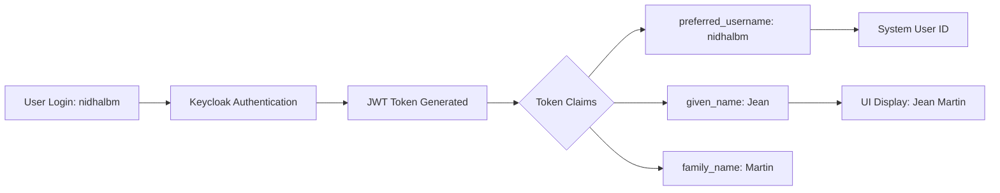

# Keycloak User Mapping Explanation

## Overview

The MYB application uses **Keycloak** as its Identity and Access Management (IAM) system. This creates a separation between **authentication identity** (who you log in as) and **application user profile** (how you're displayed in the system).

## Why You See Different Names

### The Scenario
- **Login username**: `nidhalbm`
- **Displayed name**: `Jean Martin`

### Root Cause
This happens because Keycloak stores two different sets of user information:

1. **Authentication Credentials** (Username/Email)
   - Username: `nidhalbm`
   - Email: `nidhalbm@example.com`
   - Used for: Logging in, JWT token generation

2. **Profile Information** (Display Name)
   - First Name: `Jean`
   - Last Name: `Martin`
   - Used for: UI display, user identification in the app

### How It Works



## Technical Implementation

### 1. Keycloak Token Structure

When you log in as `nidhalbm`, Keycloak generates a JWT token with these claims:

```json
{
  "sub": "e1234567-89ab-cdef-0123-456789abcdef",
  "preferred_username": "nidhalbm",
  "email": "nidhalbm@example.com",
  "given_name": "Jean",
  "family_name": "Martin",
  "name": "Jean Martin",
  "realm_access": {
    "roles": ["coproperty-owner", "user"]
  }
}
```

### 2. Frontend Token Processing

The application extracts and uses different claims for different purposes:

**File**: [libs/coproperty-module/services/auth-role.service.ts](../../src/front/myb.front/libs/coproperty-module/services/auth-role.service.ts)

```typescript
initializeFromKeycloak(keycloakToken: any): void {
  const user: UserWithRole = {
    id: keycloakToken.sub,                    // System ID
    email: keycloakToken.email,               // nidhalbm@example.com
    firstName: keycloakToken.given_name,      // "Jean"
    lastName: keycloakToken.family_name,      // "Martin"
    // ...
  };
}
```

**File**: [libs/auth/src/lib/keycloak.service.ts](../../src/front/myb.front/libs/auth/src/lib/keycloak.service.ts)

The service loads the user profile from Keycloak:

```typescript
async loadUserProfile(): Promise<void> {
  try {
    const profile = await this.keycloak.loadUserProfile();
    // profile.firstName = "Jean"
    // profile.lastName = "Martin"
    this.profileSubject.next(profile);
  } catch (error) {
    console.error('Error loading profile:', error);
  }
}
```

## Why This Design?

### Benefits of Separation

1. **Security**: Login credentials can be technical/secure (nidhalbm) while display names are user-friendly
2. **Privacy**: Username doesn't have to reveal real identity
3. **Flexibility**: Users can change display names without changing authentication
4. **Multi-tenancy**: Same user can have different roles/names in different contexts
5. **SSO Support**: Works with corporate systems where usernames are employee IDs

### Common Use Cases

| Login Username | Display Name | Use Case |
|----------------|--------------|----------|
| `nidhalbm` | Jean Martin | Test/Demo account |
| `employee_12345` | John Doe | Corporate SSO integration |
| `owner_a001` | Marie Dupont | Automated user provisioning |

## How to Verify/Fix User Mapping

### Method 1: Check Keycloak Admin Console

1. Navigate to: `http://localhost:8080/admin`
2. Login with admin credentials
3. Select Realm: `MYB`
4. Go to: **Users** → Search for `nidhalbm`
5. View the **Details** tab:
   - Username: `nidhalbm`
   - Email: `nidhalbm@example.com`
   - First Name: `Jean`
   - Last Name: `Martin`

### Method 2: Inspect JWT Token

1. Login to the application
2. Open Browser DevTools → Application/Storage → Local Storage
3. Find the Keycloak token
4. Decode it at [jwt.io](https://jwt.io) to see all claims

### Method 3: API Response

Check the Keycloak UserInfo endpoint:

```bash
curl -X GET http://localhost:8080/realms/MYB/protocol/openid-connect/userinfo \
  -H "Authorization: Bearer {access_token}"
```

Response:
```json
{
  "sub": "...",
  "preferred_username": "nidhalbm",
  "given_name": "Jean",
  "family_name": "Martin",
  "email": "nidhalbm@example.com"
}
```

## Fixing Display Name Mismatch

### Option 1: Update Keycloak User Profile

If you want `nidhalbm` to display as `Nidhal B`:

1. Go to Keycloak Admin → Users → `nidhalbm`
2. Edit the user:
   - First Name: `Nidhal`
   - Last Name: `B`
3. Save changes
4. User must logout and login again

### Option 2: Change Application to Use Username

Modify the frontend to prefer `username` over `given_name`:

**File**: `libs/coproperty-module/services/auth-role.service.ts`

```typescript
// Current code (uses firstName/lastName):
firstName: keycloakToken.given_name || '',
lastName: keycloakToken.family_name || '',

// Alternative (use username):
firstName: keycloakToken.preferred_username || '',
lastName: '',
// Or derive name from username:
firstName: this.deriveNameFromUsername(keycloakToken.preferred_username),
```

### Option 3: Add Custom Claim Mapping

Configure Keycloak to use a different field for display name:

1. Keycloak Admin → Realm Settings → MYB
2. Go to **Client Scopes** → `profile`
3. Add a **Mapper**:
   - Name: `display-name`
   - Mapper Type: `User Attribute`
   - User Attribute: `displayName`
   - Token Claim Name: `display_name`
4. Update the application to use `token.display_name`

## Data Flow Summary

```
┌─────────────────┐
│  Keycloak DB    │
│  User: nidhalbm │
│  First: Jean    │
│  Last: Martin   │
└────────┬────────┘
         │
         ↓ Authentication
┌─────────────────┐
│   JWT Token     │
│ username: ...   │
│ given_name: ... │
│ family_name: ...│
└────────┬────────┘
         │
         ↓ Token Processing
┌─────────────────┐
│  Frontend App   │
│  Display: Jean  │
│  Martin         │
└─────────────────┘
```

## Best Practices

1. **For Production**:
   - Keep authentication username technical/secure
   - Use `given_name` + `family_name` for display
   - Implement user profile editing in the app

2. **For Development**:
   - Use descriptive test account names
   - Document test users clearly
   - Consider using email as username

3. **For SSO Integration**:
   - Map corporate directory attributes correctly
   - Test claim mappings thoroughly
   - Provide user profile sync mechanism

## Test Users in MYB

Current test users (check Keycloak for actual values):

| Username | Display Name | Role | Description |
|----------|--------------|------|-------------|
| `nidhalbm` | Jean Martin | coproperty-owner | Owner test account |
| `admin` | Admin User | system-admin | System administrator |
| `syndic1` | Marie Dupont | coproperty-syndic | Property manager |

## Related Files

- **Frontend Auth Service**: `libs/auth/src/lib/keycloak.service.ts`
- **Role Mapping Service**: `libs/coproperty-module/services/auth-role.service.ts`
- **User Models**: `libs/coproperty-module/models/user-role.models.ts`
- **Backend Auth**: `src/services/user-manager/Myb.UserManager.Sevices/UserService.cs`

## Troubleshooting

### Issue: Display name not updating after changing in Keycloak
**Solution**: Clear browser cache, logout, and login again. Tokens are cached.

### Issue: Wrong name appears for some users
**Solution**: Check token claims mapping in Keycloak client configuration.

### Issue: Username shows instead of name
**Solution**: Verify `given_name` and `family_name` are set in Keycloak user profile.

---

**Last Updated**: February 3, 2026
**Maintainer**: MYB Development Team
